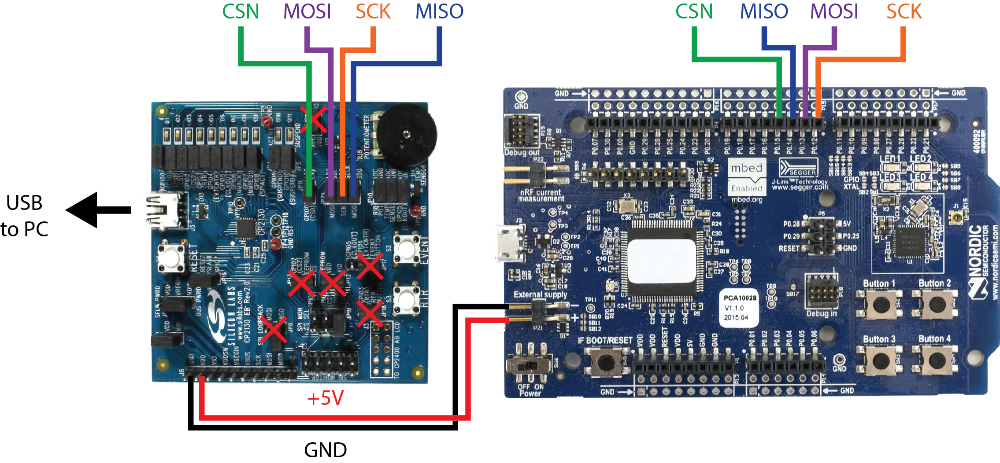

# WAND
Design files and source code for the Wireless Artifact-free Neuromodulation Device, as published in Nature Biomedical Engineering

## Getting started

To setup the WAND system, you will need:
1. WAND (or WAND mini) board
1. 3.7 V Li-ion battery (we've been using [Renata ICP521630PM](https://www.mouser.com/ProductDetail/Renata/ICP521630PM?qs=QkjX1Or4MHEeJ7xWMplNJA%3D%3D), though 3.7 V battery should work)
1. WAND base-station receiver
1. Computer running custom GUI
1. Dual-NMIC versions of WAND have a battery charging circuit on-board ([Analog Devices LTC4065](https://www.analog.com/en/products/ltc4065.html)). WAND mini boards require a separate charger, which can be something like [this](https://www.sparkfun.com/products/12711).

The custom GUI can be found in the associated WAND_GUI code repository. Instructions on setup and use are found in the README there.

## Setting up the base-station receiver

The simplest way to create a receiver device to communicate wirelessly with WAND is to use the development kits for the associated chips. These are:
1. [Silicon Labs CP2130EK](https://www.silabs.com/products/development-tools/interface/cp2130ek-evaluation-kit) - evaluation board for the CP2130 USB-to-SPI interface to connect the receiver radio to your computer
1. [Nordic nRF51 DK](https://www.nordicsemi.com/Software-and-Tools/Development-Kits/nRF51-DK) - development board for the nRF51822 Bluetooth radio

The CP2130EK should be connected to your computer via USB. The nRF51 DK receives power from the CP2130EK and connects to it via an SPI interface. Remove all jumpers on the CP2130EK marked with a red X in the image below. Additionally, remove the jumpers for the SPI signals and connect them to the nRF51DK as shown:

The CP2130EK is ready to go out of the box, while the nRF51 DK must be flashed with the required code for WAND. The program files can be found in the WAND_Radio repository under WAND_Radio/OMNI/GUI/gcc/_build.
